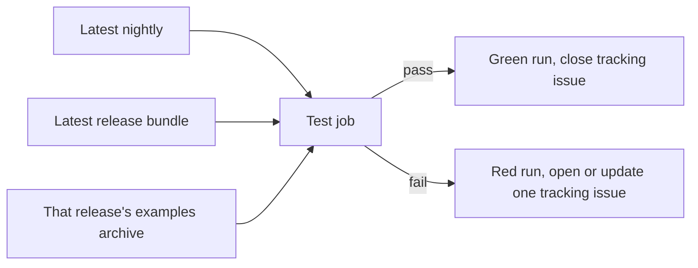

# Target workflows for Roc package repositories

This page describes the repository layout and four workflows that Roc package
repositories are migrating to. It is the reference a maintainer or agent works
from when aligning a repository. The [rollout page](rollout.md) records which
repositories have adopted it and what each pilot taught us.

The model is being introduced gradually. Every practice below carries a status:

| Status | Meaning |
| --- | --- |
| Proposed | Designed, with no repository running it end to end |
| Piloted | Running in the named repositories; expect changes |
| Battle-tested | Unchanged across all three pilots and at least one release each |

Do not present a Proposed or Piloted practice to package users as a guarantee.
Repositories that have not migrated keep following the
[package maintainer walkthrough](package-maintainer-guide.md), which describes
the earlier compiler-pin model.

## What changes

| Concern | Earlier model | Target model |
| --- | --- | --- |
| Tooling compiler | Whatever the repository pins | `roc-stable`: a release named in `Blueprint.roc` and pinned by `Blueprint.lock` |
| Package compiler | `.roc-version` or `roc` header pins | The floating latest nightly; no pin |
| Compiler updates | Daily pin-bump PR with automatic merge | None for the package; a reviewed edit to `Blueprint.roc` when the tooling compiler moves |
| Automation scripts | Python, some bash | Roc scripts run by `roc-stable` |
| Repository examples | Released package URL, `roc` pin | Relative package path, no `roc` pin |
| Published examples | The repository's files | An examples archive attached to each release |
| Nightly workflow | Proposes and validates a new pin | Tests the latest release against the latest nightly |

## Two compilers, two jobs

A migrated repository uses two Roc compilers. They are never interchangeable.

| Command | Selected by | Used for |
| --- | --- | --- |
| `roc-stable` | The release tag named in `Blueprint.roc` | Running the repository's automation scripts |
| `roc` (in CI also `roc-nightly`) | Not pinned: the latest published nightly | Checking, testing, bundling and running the package and its examples |

`roc-stable` exists so that repository tooling keeps working when a nightly
breaks something. The package deliberately floats, because the question a
package maintainer needs answered is whether the package works with the compiler
users will install today.

"Latest nightly" means the most recent release published by
[`roc-lang/nightlies`](https://github.com/roc-lang/nightlies). This page treats
that as the last green build. Nothing in this automation checks upstream CI
status separately.

Status: Proposed. `roc-stable` shebang scripts with a separate nightly compiler
already run in roc-pandoc, selected there by an earlier mechanism.

## Repository layout

```text
Blueprint.roc        development environment and named tasks
Blueprint.lock       pinned inputs, including the Roc overlay revision
package/main.roc     the package; no `roc` header field
examples/            applications that depend on ../package/main.roc
scripts/*.roc        executable automation entry points
scripts/src/*.roc    modules shared by those scripts
tests/               package-specific cases and expected output
```

A migrated repository contains no `.roc-version`, no `roc: "…"` header field in
any Roc file, and no `.github/roc-nightly.json`.

## Pin the environment with Blueprint

`Blueprint.roc` declares the tools a contributor and CI need. `Blueprint.lock`
pins them. Both are committed. The environment is realised by
[roc-blueprint](https://github.com/lukewilliamboswell/roc-blueprint) using Nix,
on a contributor's machine and in CI alike.

`Blueprint.roc` names the exact nightly release the repository uses for
tooling. The binary comes from
[roc-overlay](https://github.com/lukewilliamboswell/roc-overlay), which packages
every recorded nightly under its release tag. The environment exposes that one
release under the command name `roc-stable`, and provides no bare `roc`:

```roc
app [config] { pf: platform "<roc-blueprint release URL>" }

config = [
	Name("roc-example"),
	Overlay("roc", "github:lukewilliamboswell/roc-overlay"),
	Environment(
		"dev",
		[
			Overlays(["roc"]),
			Command("roc-stable", "rocpkgs.nightly-2026-09-10-a670e34"),
		],
	),
	Shell("default", [Use("dev")]),
	Task("check", [Use("dev"), Run(["scripts/check_all.roc"])]),
]
```

Add other tools the scripts call, such as `pandoc`, to the environment so CI and
contributors use the same versions.

The two files divide the work. `Blueprint.roc` states which release is the
tooling compiler, where a reviewer can read it. `Blueprint.lock` pins the
overlay revision that supplies that release's download URLs and hashes. There is
no shared registry of stable versions: each repository chooses its own tag, and
"stable" means only that the repository does not move it without review.

Status: Proposed. roc-parser, roc-gui and weaver carry a `Blueprint.roc` today
that installs an explicit nightly tag as plain `roc`.

### Work locally

A contributor needs Nix, `blueprint`, and a current nightly `roc` on `PATH`.

```sh
blueprint run check      # run a declared task in the pinned environment
blueprint shell          # or enter the environment and run scripts directly
```

Inside the environment `roc-stable` is the pinned compiler, and the
contributor's own `roc` remains visible for package work.

## Write automation as Roc scripts

Each entry point under `scripts/` is an executable Roc application:

```roc
#!/usr/bin/env roc-stable
app [main!] {
	cli: platform "https://github.com/roc-lang/basic-cli/releases/download/<version>/<hash>.tar.zst",
}
```

- Start with the `roc-stable` shebang and commit the file as executable.
- Omit the `roc` header field. `Blueprint.lock` is the only compiler authority
  for scripts.
- Reference every dependency by immutable release URL with its content hash.
  Scripts never depend on the repository's own package by relative path.
- Run package work with the compiler named by the `ROC_NIGHTLY` environment
  variable, falling back to `roc`. Never use `roc-stable` to check, test or
  bundle the package.
- Put pure logic in `scripts/src/` modules with `expect` tests, and run those
  tests from the main check script.
- Pass arguments after `--`, for example `scripts/test_goldens.roc -- --update`.

New automation is not written in Python or bash. Existing scripts are ported as
each repository migrates; the [rollout page](rollout.md) tracks what remains.

Status: Piloted in roc-pandoc, which still carries a `roc` field in its script
headers.

## Keep examples honest

Repository examples exercise the working tree:

```roc
app [main!] {
	cli: platform "https://github.com/roc-lang/basic-cli/releases/download/<version>/<hash>.tar.zst",
	ansi: "../package/main.roc",
}
```

The package is a relative path. Other dependencies, including the platform, stay
on immutable release URLs. There is no `roc` field.

Each release attaches an examples archive named
`<repository>-examples-<version>.zip`. It holds complete copies of the examples
in which the package dependency is replaced by that release's bundle URL, plus a
short README. Nothing else in a header changes. The release workflow builds the
archive from the tested commit and tests the archive before attaching it.

Committed examples are never rewritten after a release, so no release follow-up
pull request is needed. A user who wants a starter downloads the archive for the
release they are installing.

Status: Piloted. roc-parser 2.0.0 ships this archive. roc-ansi builds one as
`.tar.gz` and has not yet published a release containing it.

## The four workflows

Every `uses:` reference is a full commit SHA. Top-level `permissions` is `{}` or
`contents: read`, and each job states what it needs.

| Workflow | Trigger | What it proves | Token access |
| --- | --- | --- | --- |
| `ci.yml` | Pull request, push to the default branch | Scripts pass on `roc-stable`; the working-tree package and examples pass on the latest nightly | `contents: read` |
| `release.yml` | Manual dispatch; pull request as a dry run | The exact bundle and examples archive proposed for publication work | `contents: read`; the publish job alone has `contents: write` behind a protected environment |
| `nightly.yml` | Daily schedule, manual dispatch | The latest published release and its examples archive work with the latest nightly | Test job `contents: read`; report job `issues: write` |
| `update-blueprint.yml` | Weekly schedule, manual dispatch | Nothing by itself: it proposes a lock update that `ci.yml` then validates | `contents: write`, `pull-requests: write` |

Status: Proposed for all four.

### Continuous integration

1. Install Nix and `blueprint` with `actions/setup-blueprint`.
2. Install the latest nightly with `setup-roc`, and record its tag.
3. Run `blueprint run check`.

The job has no write access and handles untrusted pull-request code.

A pull request can fail because a new nightly arrived, with no fault in the
change itself. Compare with the latest `nightly.yml` run and with the default
branch before treating a failure as a regression in the pull request.

### Release

The release workflow runs the same check, builds the bundle with the latest
nightly, tests that exact bundle from a loopback server, builds and tests the
examples archive against it, and publishes both.

The release notes must state the compiler versions used, as printed by
`roc version` and `roc-stable version`. This record replaces the header pin as
the statement of what the release was built and tested with.

### Nightly compatibility

This workflow answers one question: does the release users download today still
work with today's compiler?



The diagram shows the inputs to one nightly run and its two outcomes.

- Resolve the nightly tag once and pass it to every job. Matrix jobs must not
  each resolve "latest" themselves.
- Download the latest release's examples archive and run it unchanged. Do not
  rebind it to the working tree, and do not test the default branch's examples
  here: new APIs on the default branch are not evidence about a release.
- Use the default branch's scripts, on `roc-stable`, to drive the test.
- A failure means the release needs a patch release. It is not a reason to
  change the archive, which is immutable.
- Report from a separate job that runs no repository or archive code. It keeps
  one tracking issue: opened on the first failure, updated on later failures,
  closed on the next pass.

This workflow never opens a pull request, commits, merges, or publishes.

### Lock updates

`update-blueprint.yml` runs `blueprint update` on the default branch and opens a
pull request whose only changed file is `Blueprint.lock`. The commit is created
through GitHub's commit API so that it is signed. A maintainer reviews and merges
it after `ci.yml` passes; there is no automatic merge.

A lock update moves the overlay revision and tool versions. It never changes
which release is `roc-stable`, because that tag is written in `Blueprint.roc`.

## Change the tooling compiler

1. Choose a published nightly release.
2. Open a pull request changing the tag in `Blueprint.roc`. If the locked overlay
   revision predates that release, run `blueprint update` for the overlay input
   in the same pull request.
3. Merge after `ci.yml` passes. Fix any script the new compiler breaks in that
   pull request, so the tag and the scripts move together.

This is a maintainer's decision per repository. Nothing changes it
automatically, and repositories need not agree.

## Evidence for each claim

| Claim | Evidence |
| --- | --- |
| Tooling uses the pinned compiler | Scripts start with the `roc-stable` shebang; CI prints `roc-stable version` |
| No stray compiler pins remain | The check script fails when a `roc:` header field or `.roc-version` exists |
| Repository examples test the working tree | The check script fails unless each example names the relative package path |
| Published examples work | `release.yml` tests the archive before upload; `nightly.yml` tests the published archive |
| The release names its compilers | Release notes contain both version strings |
| The latest release works on the latest nightly | The most recent `nightly.yml` run, and the absence of an open tracking issue |

## What this model does not do

- It does not make package builds reproducible. The package compiler floats by
  design; only the tooling environment is pinned.
- It does not verify upstream compiler quality beyond using a published nightly.
- It does not support repositories that must hold the package on an older
  compiler line. Those stay on the
  [compiler compatibility branch policy](maintenance-releases.md) until this
  model is extended.
- It does not yet cover platforms with native build inputs. The
  [platform build-input guide](platform-build-inputs.md) still governs those.
