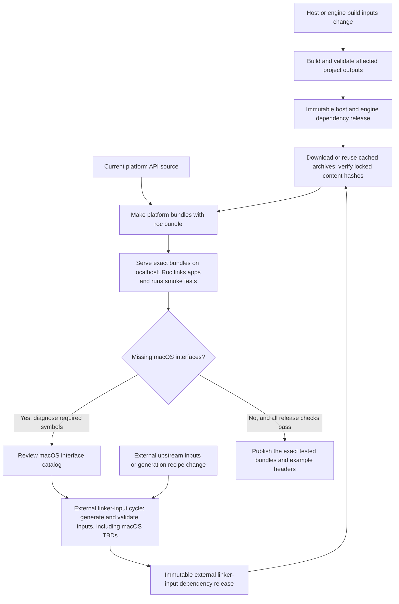

# Manage platform build inputs across validation and releases

Platforms often need native builds before Roc can link an application.
Expensive outputs reused across releases can have their own dependency releases;
small hosts can be built in a read-only job of the platform release workflow.
In either case, test and publish the same artifact bytes. The consumer repository
owns this implementation; the shared nightly controller neither builds these artifacts nor
verifies their integrity or provenance.

Use this guide alongside the [maintainer walkthrough](package-maintainer-guide.md)
and [validation contract](consumer-validation.md). It describes the intended
workflow, not a claim that adopting the shared controller implements it.

For a platform repository, keep three release cycles visibly separate:

| Cycle | Owner and identity | Normal PR behavior |
| --- | --- | --- |
| Linker-input release | Platform-owned native inputs selected by a content lock; published independently from a material producer change | Restore/download the selected target archives and verify their locked hashes. Never rebuild them implicitly. |
| Host release | Platform implementation outputs such as `libhost.a`, selected by their own host lock or built as an explicit host candidate | Reuse when the host fingerprint is current. A host-source or ABI change may intentionally build new host outputs without changing linker inputs. |
| Platform bundle release | The user-facing Roc platform source plus the selected host and linker-input bytes | Assemble and test the exact selected inputs, then publish those exact bundle bytes. Do not turn bundle preparation into a native bootstrap build. |

This separation keeps invalidation honest and limits the cost and authority of
each operation. Treating every file that reaches the linker as one artifact would
rebuild stable operating-system inputs for ordinary host changes; treating the
bundle as its native build environment would make a source-only release depend on
privileged toolchains and mutable ambient state. Separate locks let review answer
which bytes changed and why. The tradeoff is more than one manifest and release
lifecycle, so use independent releases only where reuse and build cost justify
that bookkeeping.

`libhost.a` and `host.lib` are host outputs, not linker-input release assets.
Conversely, operating-system import libraries, runtime libraries, interface stubs,
resource objects, and similar entries required by `platform/main.roc` are linker
inputs even when the platform repository contains their generation recipes.
Classify by ownership and invalidation, not merely by the fact that the final Roc
linker receives the file.

Choose the smallest lifecycle that fits the project:

| Project shape | Suitable starting point |
| --- | --- |
| Pure Roc library, such as roc-ansi or weaver | Bundle source; validate examples against their released platform. No native producer is needed for the library itself. |
| Small platform host, such as the Zig template or roc-wasm4 | Build the host, bundle once, test the bundle, then publish those bytes in one workflow. |
| Expensive hosts and external libraries, such as roc-signals or roc-ray | Release reusable inputs independently where useful; assemble them under reviewed locks. |

These are architectural examples from the [Nightly status project set](../README.md#nightly-status),
not compliance claims about their workflows. Test-only hosts in library repositories
also need freshness checks when reused, but need not become public dependencies.
During adoption, inventory existing inputs and establish their build recipes,
digests and target coverage before enabling reuse. Explicit source builds remain
valid; unverified existing binaries must not be relabeled as verified artifacts.

## Separate the artifacts by what can invalidate them

All of these files can eventually reach a linker, but they have different owners
and rebuild triggers. Name the categories explicitly in scripts, locks and docs.

| Artifact | What it contains | What requires a new build |
| --- | --- | --- |
| Project host and engine outputs, such as `libhost.a`, `libengine.a` or a Wasm host library | Compiled project implementation for a target | Relevant source, generated inputs, dependency pins, compiler/toolchain, target ABI or build options change |
| External linker inputs, such as import libraries, runtime link files and macOS `.tbd` files | The external libraries or interfaces used by the final application link | Their upstream inputs, target contract, generation recipe or required interface catalog changes |
| Roc platform bundle | Platform API source plus the selected target outputs and linker inputs | Package source or selected input bytes change |
| Application root and companion modules | An application targeting a particular platform API and URL | Application source, compiler requirement or selected package URL changes |

A host edit can require new host archives while reusing the existing external
linker inputs. Rebuild an engine archive only when its own inputs change; if a
producer groups multiple outputs, document that granularity. A Roc compiler bump
requires compatibility validation, but only invalidates host outputs when that
compiler or its ABI artifacts actually contribute to their build identity.

For platforms that package macOS interfaces, review the required catalog before
generating and validating `.tbd` files. That generation belongs inside the external linker-input
cycle. When released separately, publish the generated files as immutable inputs.
For a static host archive, these files normally serve Roc's final link rather
than host compilation. A producer that itself links executables or shared libraries
may also consume linker interfaces. Record its actual SDK, headers, interfaces and
native build tools in its identity; do not assume the two cycles have no dependencies.

For a platform using independent producers, the flow is:

An unresolved symbol during the application link is evidence to investigate.
Confirm the library, symbol and supported target before changing the catalog;
missing project symbols, mismatched archives and ABI errors can produce similar
failures. Do not invent an export or expand the catalog automatically to make a
test pass. Producer validation can catch mistakes earlier, but a successful host
build alone does not establish that Roc can link the final application.

## Make content identity the ordinary consumer contract

Commit reviewed lock data with each dependency selection. Include the artifact
name, target, exact release location, cryptographic digest such as SHA-256, byte
size, and expected archive contents or extraction boundaries. Record available source
revision and producer build-input fingerprint separately from the archive digest.
The fingerprint answers whether a build can be reused; the digest identifies the
exact bytes a consumer accepts. Neither a version label nor a fingerprint alone
verifies a downloaded archive.

Recompute freshness fingerprints where the repository owns or vendors the producer
inputs, such as its own host source. For external binaries, consumers verify the
reviewed selection, digest, target and inventory; they need not fetch upstream
source or install its toolchain to recompute the producer's fingerprint. Recorded
producer metadata remains a claim subject to the chosen provenance policy.

Final Roc bundles have a compiler-defined content identity: preserve the filename
emitted by `roc bundle` in both localhost and published URLs. Roc uses its
base58-encoded BLAKE3 hash to verify the downloaded bundle. An additional SHA-256
in release metadata is useful but cannot replace that URL hash. See the
[Roc bundle implementation](https://github.com/roc-lang/roc/blob/8d6e3a360087038712d72bc090eaccf586cd83f7/src/bundle/bundle.zig#L266-L275)
and [download contract](https://github.com/roc-lang/roc/blob/8d6e3a360087038712d72bc090eaccf586cd83f7/src/bundle/download.zig#L42-L63).
Application users consuming that bundle need no separate native-input fetcher.

Consumers should resolve the locked artifact from a local cache, a mirror or the
recorded release URL, check size and digest before extraction, and reject a
mismatch, including on cache hits. Extract into fresh staging with bounded member
counts and expanded sizes. Accept only declared regular files and directories with
unique, portable paths; reject escapes, path collisions, links and special files.
Validate the complete inventory before making the staged result available, and do
not trust an old extracted tree solely because its cached archive verified.
Keep licenses and required runtime files in the declared inventory.
Fail clearly when a required artifact is unavailable
or stale; an ordinary consumer must not silently rebuild it or pick a newer
release.

The reviewed lock is the trust anchor. A checksum downloaded beside an archive
from the same mutable location does not independently authorize its contents.
A matching digest establishes equality with reviewed bytes, not their safety,
source origin or correctness. Review the initial artifact selection and subsequent
lock changes as dependency changes.

Hash verification is local and should work without a GitHub API call, token,
attestation service or network connection when the selected bytes are already
available. Downloading a missing artifact still requires a source of those bytes.
This reduces service dependencies; it does not make uncached downloads offline.
Apply the same principle to other downloaded inputs, including build tools where
practical, while keeping the required trust policy explicit.

## Publish provenance without confusing it with integrity

An attestation can bind an artifact digest to claims about its producer, workflow,
source revision and build. Publish it for users who want to verify that provenance.
Such verification must check the expected signer/workflow identity, source and
subject digest under a stated policy, not merely that some signature exists.
Keep ordinary locked consumption independent of that service check unless the
consumer explicitly adopts a stricter provenance policy. Verification required by
an adopted policy must fail visibly rather than silently downgrade to hashes.
Provenance does not inherently require an online check on every run: GitHub supports
[offline verification](https://docs.github.com/en/actions/how-tos/secure-your-work/use-artifact-attestations/verify-attestations-offline)
using previously obtained attestation bundles and trusted roots. Define how that
verification material is obtained and updated when adopting such a policy.

Describe only the evidence that was actually produced. A packaging workflow that
downloads and bundles an archive can attest to that assembly; its attestation
does not establish how the downloaded archive was compiled. Preserve the original
producer evidence and identify the selected dependencies in the package manifest.
A source revision in a lock is a recorded claim until supported by the producer's
evidence. Attestations do not by themselves prove reproducible builds, complete
test coverage, or absence of defects.

Publish each dependency release under a unique, immutable identity with the
exact validated archives, lock data, licenses and available provenance. Do not
replace assets or move tags. Where the hosting service supports enforced release
immutability, enable it and verify the resulting state; a naming convention alone
does not enforce immutability. Hash checks remain necessary even with immutable
hosting. On GitHub, [stage an immutable release as a draft](https://docs.github.com/en/code-security/concepts/supply-chain-security/immutable-releases),
attach all assets, verify the complete inventory and tag commit, then publish.
An interrupted draft may resume after existing assets match the recorded candidate.
A complete published release needs only verification and any remaining follow-up;
an incomplete published immutable release cannot accept missing assets and needs a
new release identity. Changed candidate bytes also need a new identity. Preserve
the original evidence and revalidate starters whenever their final URLs change.

### Publish a pull-request candidate without granting it release authority

A repository may need a linker-input release before the source change that
requires it can merge. An unprivileged workflow on the same-repository pull-request
branch builds, tests, and attests the exact candidate. A trusted workflow dispatched
from the default branch then verifies the producer run, source SHA and ref, workflow
identity, attestations, manifest, and content hashes before publishing those bytes.
It never executes scripts supplied by the candidate artifact.

The trusted workflow may add the generated content lock to the producer branch as
one lease-guarded, GitHub-signed commit. That commit changes only the configured
lock path and remains subject to ordinary review and checks. After merge, the lock
permanently selects the branch-built release; do not rebuild or relabel it on the
default branch. A content-derived tag permits recovery only when the complete
candidate is byte-identical.

`actions/publish-build-inputs` implements this boundary for producers that emit
`build-input-release.json` and its declared target archives. The consumer wrapper
exposes only a pull-request number and pins the controller action to a reviewed
full SHA. Fork changes must first move to a same-repository branch because the
controller never writes to forks.

The complete producer, publisher, generated-lock, recovery, review, and merge
contract is in [Publish linker inputs from a pull request](linker-input-releases.md).

## Choose the correct maintainer path

Use the smallest lifecycle that corresponds to the changed ownership boundary:

| Change | Required maintainer action |
| --- | --- |
| Roc source, examples, tests, docs, or an unrelated workflow | Run ordinary PR validation using the committed host/linker-input locks. No native dependency release. |
| Roc compiler pin only, including a nightly update | Validate published examples and current source using the same committed locks. No native dependency release unless the compiler actually contributes to a native output's fingerprint or ABI. |
| Host implementation, host dependency, host tool pin, host ABI, or exported project symbol | Build and validate affected host candidates. Publish/adopt new host outputs under the host lifecycle. Reuse the existing linker inputs unless their own inputs changed. |
| Linker-input source, upstream binary, interface catalog, resource source, generation recipe, target matrix, or tool pin | Build the complete linker-input candidate on a same-repository PR branch, then run the trusted publisher and review its signed lock commit. |
| `platform/main.roc` linker entries | Check classification first. A new project implementation symbol normally changes the host; a new external library/interface normally changes linker inputs. Validate that every referenced released path exists for every advertised target. |
| Platform release | Require current host and linker-input locks, assemble once, exercise target applications, and publish the exact tested bundles. |

For a stale repository-owned linker-input lock, stage the material change in a
same-repository PR first. An optional unprivileged producer run at that PR head
can build, test, and attest a candidate without publishing. Then explicitly
dispatch the trusted publisher **from the default branch** with the PR number;
it reruns the producer at the exact PR head, verifies the candidate, publishes
the immutable linker-input release, and adds a signed lock-only commit to that
PR. Revalidate the updated PR against the released lock before merging. A Roc
platform bundle is a separate, later release using that selected lock. The
[publisher procedure](linker-input-releases.md) defines the exact admission and
review checks.

An input fingerprint mismatch must be explicit. For a host, a read-only PR job may
build a host candidate because host source commonly changes with the PR. For a
locked linker-input release, routine validation fails with instructions to run the
independent producer/publisher cycle. It must not bootstrap a replacement as a
side effect of a cache miss or ordinary source validation. An implicit rebuild
would silently substitute unreviewed bytes for the dependency selected by the
lock, make results depend on whichever runner missed its cache, and hide that the
repository's declared dependency is stale.

## Keep routine pull requests ignorant of production

Routine consumers need only the lock schema, a downloader/cache, digest and archive
validation, and the selected extracted files. They do not need a native SDK,
linker-input generator, publication token, attestation lookup, or knowledge of how
the archives were produced. Keep producer jobs in their own workflow and path
scope; do not call them from general CI merely to populate a cache.

Every cache read is untrusted until the archived bytes match the locked size and
SHA-256. A cache miss downloads the exact locked release asset. A download failure
fails the job. A digest mismatch removes or ignores the bad entry and fails closed;
it never selects another release. Extraction and manifest checks happen after the
archive hash succeeds and before files become visible to the build.

Derive cache keys from the locked content identity rather than a branch, workflow
run, or mutable release label. This prevents unrelated revisions from sharing a
slot merely because their human-readable names match and makes identical reviewed
bytes reusable across PRs. Still rehash a cache hit: cache keys select storage but
do not authenticate its contents, and a poisoned, truncated, or incorrectly
restored entry can otherwise bypass the download-time check.

Nightly compiler-pin PRs follow the same consumer path. The updater owns only the
compiler-pin proposal and validation orchestration; it cannot publish platform
dependencies. When a nightly reveals a genuine new host or linker requirement,
leave that mechanical candidate open, make the material change in a separately
reviewed PR, publish the required dependency there, and retry the nightly update
after the platform's committed locks and source are compatible.

## Preserve reviewed history and authority

Use merge commits for automation PRs whose evidence names exact commits. This
keeps the attested producer commit, the publisher's signed lock-only commit, and
the nightly updater's signed pin-only commit reachable with their original
identities. Squashing manufactures a different commit and discards that useful
correspondence. It remains reasonable for a maintainer to clean up an ordinary
development branch before review, but the trusted automation must not depend on
history rewriting after it binds evidence to a SHA.

Keep the authorities distinct:

- producer and ordinary validation jobs may execute candidate code but are
  read-only;
- the platform's trusted publisher job invokes only its full-SHA-pinned shared
  controller action with release and lock-write permission;
- the nightly merge job can merge only its verified compiler-pin-only candidate;
- the platform release publisher consumes already selected dependencies and
  publishes only explicitly dispatched, tested platform bundles.

This split is what makes running candidate build code acceptable: compromise of
that job cannot write a release or branch. Conversely, the publisher has powerful
credentials, so it accepts only inert declared files and never executes the PR.
Least-privilege job permissions reduce the operations available if the pinned
controller or hosting account is compromised; they do not make unreviewed code
safe to run in that job.

Roll out shared automation through a reviewed `roc-automation` PR, then pin the
consumer caller to that PR's full commit SHA. The shared PR need not merge before
a controlled trial, but consumers must never pin a branch name or abbreviated SHA.
If review changes the shared implementation, update the consumer pin to the new
reviewed commit and repeat the trial. Merge the shared automation before treating
the integration as the maintained default, then upgrade consumer pins through
ordinary dependency PRs.

The full SHA makes the reviewed controller bytes stable even while the automation
PR remains open. A branch or tag could move after consumer review and silently
change code running with write permission. Pinning an unmerged SHA is therefore a
useful integration technique, not a relaxation of review: the consumer records
exactly which revision it tested, while later automation changes require a new
pin and another trial.

## Keep rebuild selection narrow and complete

Producers computing reuse identities must include every input that can affect an output:
relevant source paths and contents, generated inputs, dependency locks, build
recipes, tool versions, target configuration and build flags. Record file paths
and modes as needed to distinguish renames, deletions and symlinks. Validate the
permitted source-file kinds. Include relevant environment and SDK identities;
an unpinned runner image or ambient library can change output without a source edit.
Use a versioned fingerprint recipe and compare the same input definitions.
A whole-commit identity, together with the non-source inputs above, is a conservative
starting point, but causes needless rebuilds for unrelated edits. Narrow the source
selection only after testing the input inventory.
Include the source revision separately for traceability.

Treat workflow triggers and fingerprints as different controls. Path filters
decide when to run a producer audit; fingerprints decide whether the selected
published outputs still correspond to current inputs. A test-harness edit may
justify rerunning an audit without requiring a new dependency release. Trace shared
scripts and generated inputs transitively so a narrow filter cannot hide a real
build change. For repository-owned inputs, record the published fingerprint in lock
data or a digest-bound manifest so a shallow checkout can compare current inputs
without fetching an old producer commit. A stale host blocks reuse; PR validation
may explicitly build a new candidate in a read-only job without publishing it.

For a narrowed fingerprint, require meaningful checks for both directions: a relevant source, tool pin or
build-option change invalidates reuse, while an unrelated example or documentation
change preserves it. Check archive digest rejection and target/path confinement.
Exercise final linking against reused artifacts; a selector test alone does not
prove the selected artifacts work.

Cache hits can speed a scheduled build but do not decide whether a workflow runs,
and a cache miss must not become an implicit source build in a consumer. Preserve
the reviewed candidate commit with a merge commit so the exact validated history
remains reachable. Inspect the actual event filters and reuse decisions rather
than assuming a green PR or a different commit SHA determines them.

## Keep final release preparation small

Once independent dependency producers have supplied current outputs, a release
workflow needs the pinned Roc executable to bundle and link applications, the
artifact verification helpers, and the runtime dependencies for its smoke tests.
It should download and hash-verify the selected prebuilt inputs. Host-language
compilers and SDK generators belong in producer jobs; a stale lock should
send the maintainer back to that producer cycle.

For a repository publishing web and native GUI platforms with distinct APIs,
create separate `roc bundle` packages. A web package may include its Wasm library and a native
test host that simulates the browser; a GUI package contains its native GUI hosts.
Sharing an engine does not make their platform APIs or application roots
interchangeable. Give examples separate roots and package URLs, even when they
reuse application modules.

Bundle once, then pass those exact archives to the target runners. Each runner
should serve the applicable packages over localhost and run their example smoke
tests against temporary roots using those URLs. Preserve the distinct APIs and
test the advertised target matrix, with required runtime setup such as a display
or browser where applicable. Do not count a simulated browser test as proof of
the real browser boundary. Local macOS smoke tests remain useful even if ordinary
CI uses Linux; report that coverage accurately and validate every advertised
release target before publication. Check package size limits and target contents
early, rather than discovering during publication that the proposed package
cannot carry its advertised hosts.

Combine publication when packages share a release version and must ship together.
Independent APIs or target variants may have separate versions and workflows;
record and test the advertised package/target/compiler combinations in each case.
Keep preparation, validation and publication connected by recorded artifact digests
and the exact source SHA, regardless of workflow layout. After all required checks
pass, publish the exact tested platform archives and complete example starters
whose headers name their distinct final asset URLs. Record archive digests,
selected dependency identities, source revision and compiler requirement in the
release manifest. Verify that URL substitution changes only the intended headers
and test the published downloads as described in the
[release follow-up contract](consumer-validation.md#release-follow-up-contract).
Publish the retained tested archives; any rebuilt artifact must have its identity
checked and changed bytes validated as a new candidate. Keep write permission in
the publication job, authorized only by an explicit release dispatch on an allowed
reviewed branch and exact event SHA. Consume artifacts from that run; never execute
unreviewed PR source or artifact-supplied scripts with release credentials. Pin
shared actions and workflows to full SHAs, disable persisted checkout credentials,
and keep PR and nightly-validation runs unable to publish, deploy or create follow-ups.
Use the [release policy](maintenance-releases.md#release-and-backport-workflow) and
[security model](security-model.md) for the remaining authority boundaries.
