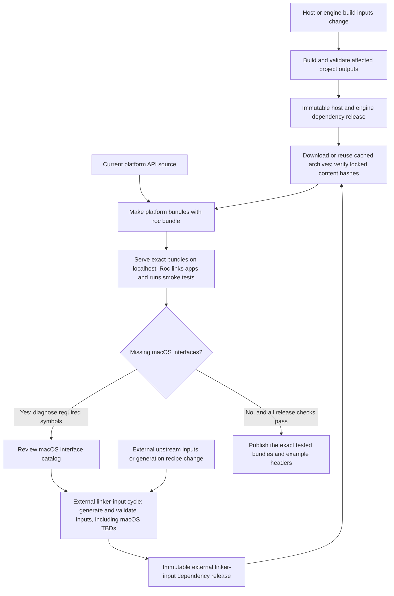

# Reuse platform build inputs across validation and releases

Platforms often need expensive native builds before Roc can link an application.
Give those builds their own dependency releases so ordinary PRs and platform
publication can consume verified outputs. The consumer repository owns this
implementation; the shared nightly controller neither builds these artifacts nor
verifies their integrity or provenance.

Use this guide alongside the [maintainer walkthrough](package-maintainer-guide.md)
and [validation contract](consumer-validation.md). It describes the intended
workflow, not a claim that adopting the shared controller implements it.

## Separate the artifacts by what can invalidate them

All of these files can eventually reach a linker, but they have different owners
and rebuild triggers. Name the categories explicitly in scripts, locks and docs.

| Artifact | What it contains | What requires a new build |
| --- | --- | --- |
| Project host and engine outputs, such as `libhost.a`, `libengine.a` or a Wasm host library | Compiled project implementation for a target | Relevant source, generated inputs, dependency pins, compiler/toolchain, target ABI or build options change |
| External linker inputs, such as import libraries, runtime link files and macOS `.tbd` files | The external libraries or interfaces used by the final application link | Their upstream inputs, target contract, generation recipe or required interface catalog changes |
| Roc platform bundle | Platform API source plus the selected target outputs and linker inputs | Package source or selected input bytes change |
| Application root and companion modules | An application targeting a particular platform API and URL | Application source, compiler requirement or selected package URL changes |

A host edit can require new host archives while reusing the existing external
linker inputs. Rebuild an engine archive only when its own inputs change; if a
producer groups multiple outputs, document that granularity. A Roc compiler bump
requires compatibility validation, but only invalidates host outputs when that
compiler or its ABI artifacts actually contribute to their build identity.

For macOS, review the required external interface catalog before generating and
validating `.tbd` files. That generation belongs inside the external linker-input
cycle. Publish the generated files in its immutable dependency release. The
packaged `.tbd` files describe interfaces for Roc's final link; they are not a
dependency of compiling the host. A host producer may separately require SDK
headers or native build tools; record those actual build inputs in its identity.

An unresolved symbol during the application link is evidence to investigate.
Confirm the library, symbol and supported target before changing the catalog;
missing project symbols, mismatched archives and ABI errors can produce similar
failures. Do not invent an export or expand the catalog automatically to make a
test pass. Producer validation can catch mistakes earlier, but a successful host
build alone does not establish that Roc can link the final application.

## Make content identity the ordinary consumer contract

Commit reviewed lock data with each dependency selection. Include the artifact
name, target, exact release location, cryptographic digest such as SHA-256, byte
size, and expected archive contents or extraction boundaries. Record the source
revision and relevant build-input fingerprint separately from the archive digest.
The fingerprint answers whether a build can be reused; the digest identifies the
exact bytes a consumer accepts. Neither a version label nor a fingerprint alone
verifies a downloaded archive.

Consumers should resolve the locked artifact from a local cache, a mirror or the
recorded release URL, check size and digest before extraction, and reject a
mismatch. Enforce target and path boundaries when extracting, including rejection
of escaping paths and unexpected links. Keep licenses and required runtime files
in the declared inventory. Fail clearly when a required artifact is unavailable
or stale; an ordinary consumer must not silently rebuild it or pick a newer
release.

The reviewed lock is the trust anchor. A checksum downloaded beside an archive
from the same mutable location does not independently authorize its contents.
A matching digest establishes equality with reviewed bytes, not their safety,
source origin or correctness. Review the initial artifact selection and subsequent
lock changes as dependency changes.

Hash verification is local and should work without a GitHub API call, token,
attestation service or network connection when the selected bytes are already
available. Downloading a missing artifact still requires a source of those bytes.
This reduces service dependencies; it does not make uncached downloads offline.
Apply the same principle to other downloaded inputs, including build tools where
practical, while keeping the required trust policy explicit.

## Publish provenance without confusing it with integrity

An attestation can bind an artifact digest to claims about its producer, workflow,
source revision and build. Publish it for users who want to verify that provenance.
Such verification must check the expected signer/workflow identity, source and
subject digest under a stated policy, not merely that some signature exists.
Keep ordinary locked consumption independent of that service check unless the
consumer explicitly adopts a stricter provenance policy. Verification required by
an adopted policy must fail visibly rather than silently downgrade to hashes.

Describe only the evidence that was actually produced. A packaging workflow that
downloads and bundles an archive can attest to that assembly; its attestation
does not establish how the downloaded archive was compiled. Preserve the original
producer evidence and identify the selected dependencies in the package manifest.
A source revision in a lock is a recorded claim until supported by the producer's
evidence. Attestations do not by themselves prove reproducible builds, complete
test coverage, or absence of defects.

Publish each dependency release under a unique, immutable identity with the
exact validated archives, lock data, licenses and available provenance. Do not
replace assets or move tags. Where the hosting service supports enforced release
immutability, enable it and verify the resulting state; a naming convention alone
does not enforce immutability. Hash checks remain necessary even with immutable
hosting. If publication is interrupted, inspect existing assets and resume only
when their identities match the recorded candidate; changed bytes need a new
release identity.

## Keep rebuild selection narrow and complete

Compute a deterministic fingerprint from every input that can affect an output:
relevant source paths and contents, generated inputs, dependency locks, build
recipes, tool versions, target configuration and build flags. Record file paths
and modes as needed to distinguish renames, deletions and symlinks. Validate the
permitted source-file kinds. Do not substitute the whole repository commit for
this identity: a documentation or example edit should not invalidate an unchanged
host. Include the source revision separately for traceability.

Treat workflow triggers and fingerprints as different controls. Path filters
decide when to run a producer audit; fingerprints decide whether the selected
published outputs still correspond to current inputs. A test-harness edit may
justify rerunning an audit without requiring a new dependency release. Trace shared
scripts and generated inputs transitively so a narrow filter cannot hide a real
build change. Record the published fingerprint in lock data so a shallow checkout
can compare current inputs without fetching an old producer commit.

Require meaningful checks for both directions: a relevant source, tool pin or
build-option change invalidates reuse, while an unrelated example or documentation
change preserves it. Check archive digest rejection and target/path confinement.
Exercise final linking against reused artifacts; a selector test alone does not
prove the selected artifacts work.

Cache hits can speed a scheduled build but do not decide whether a workflow runs,
and a cache miss must not become an implicit source build in a consumer. Squash
merging can trigger a new default-branch run even if the PR used a warm cache.
Inspect the actual event filters and reuse decisions rather than assuming a green
PR or a different commit SHA determines them.

## Keep final release preparation small

Once the dependency producers have supplied current outputs, a combined release
workflow needs the pinned Roc executable to bundle and link applications, the
artifact verification helpers, and the runtime dependencies for its smoke tests.
It should download and hash-verify the selected prebuilt inputs. Host-language
compilers and SDK generators belong in producer workflows; a stale lock should
send the maintainer back to that producer cycle.

For a repository publishing web and native GUI platforms, create two distinct
`roc bundle` packages. A web package may include its Wasm library and a native
test host that simulates the browser; a GUI package contains its native GUI hosts.
Sharing an engine does not make their platform APIs or application roots
interchangeable. Give examples separate roots and package URLs, even when they
reuse application modules.

Bundle once, then pass those exact archives to the target runners. Each runner
should serve both packages over localhost and run the applicable example smoke
tests against temporary roots using those URLs. Preserve the distinct APIs and
test the advertised target matrix, with required runtime setup such as a display
or browser where applicable. Do not count a simulated browser test as proof of
the real browser boundary. Local macOS smoke tests remain useful even if ordinary
CI uses Linux; report that coverage accurately and validate every advertised
release target before publication. Check package size limits and target contents
early, rather than discovering during publication that the proposed package
cannot carry its advertised hosts.

Use one publishing workflow for the combined release. After all required checks
pass, publish the exact tested platform archives and complete example starters
whose headers name their distinct final asset URLs. Record archive digests,
selected dependency identities, source revision and compiler requirement in the
release manifest. Verify that URL substitution changes only the intended headers
and test the published downloads as described in the
[release follow-up contract](consumer-validation.md#release-follow-up-contract).
Rebuilding after the smoke tests would produce a different candidate requiring
its own validation. Keep write permission in the publication job and keep
validation-only runs unable to publish.
